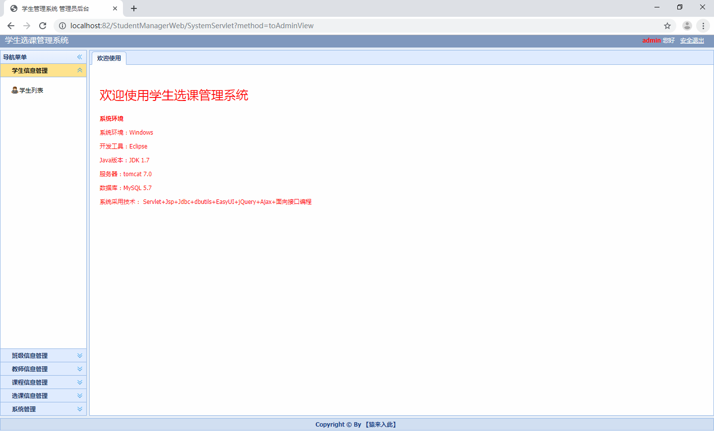
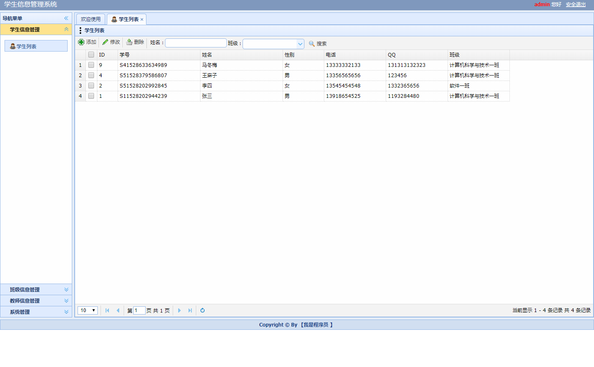
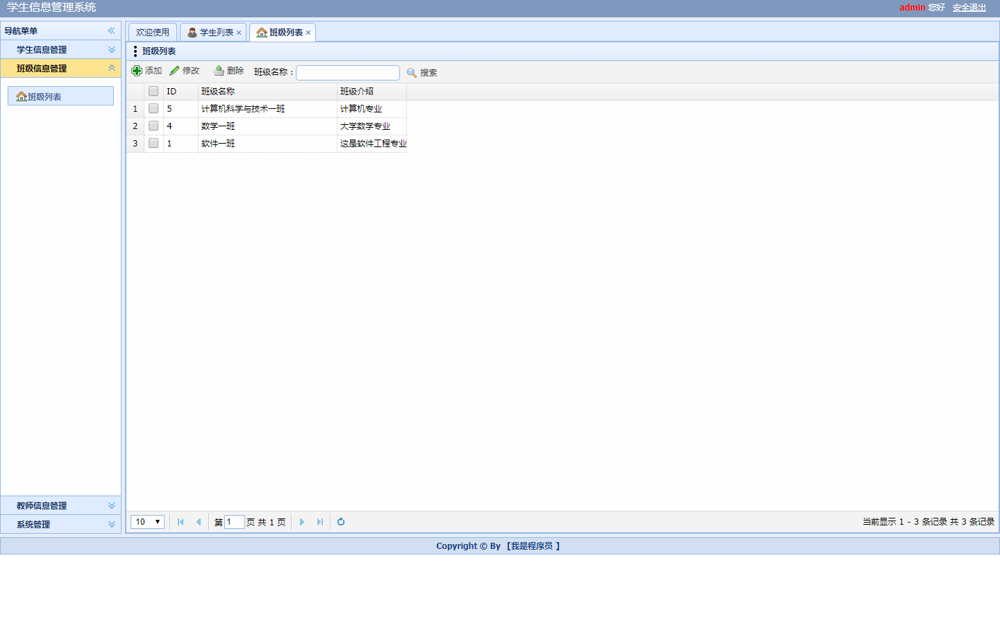

基于ssm（非maven）学生选课管理系统

本系统已收录公众号【java项目源码】，需要源码请自行扫码一下二维码关注公众号下载

本系统分为三种权限：

1.学生：登陆后管理自己的信息，可以选课以及推选功能，修改密码

2.教师：学生信息管理（增删改查）,班级信息管理（增删改查）,课程信息管理（增删改查）,选课信息管理（增删改查）,
自己的信息管理以及修改密码

3.管理员：学生信息管理（增删改查）,教师信息管理（增删改查）,班级信息管理（增删改查）,
课程信息管理（增删改查）,选课信息管理（增删改查）以及修改密码

运行项目步骤：

1.项目导入本地后可能会出现红色感叹号，右键项目properties选择java build path修改对应红叉的配置

2.将sql文件导入本地数据库

3.将util下的DbUtil中修改本地数据库连接

4.右键项目运行

运行截图：

